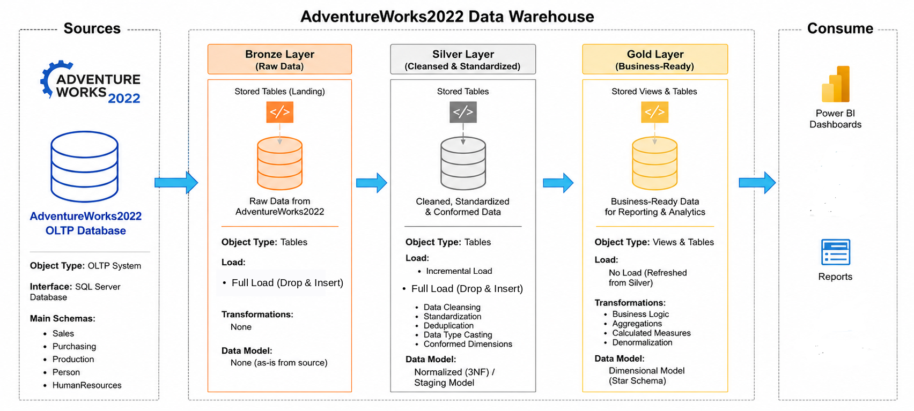
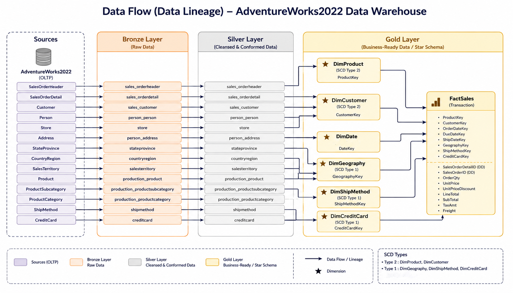
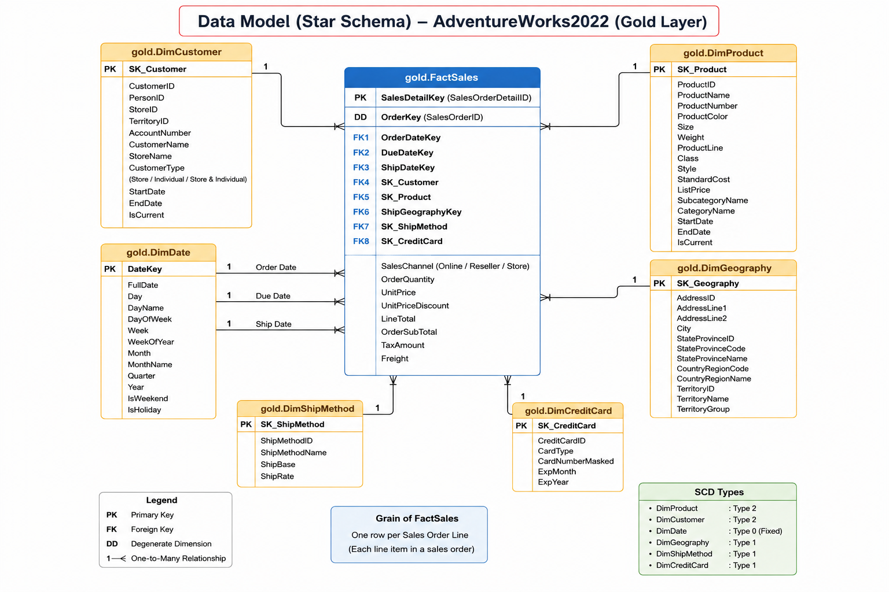

# AdventureWorks2022 Data Warehouse

## Overview

This project implements a modern Data Warehouse solution using the **AdventureWorks2022** sample database. The ETL pipeline follows a layered architecture (Bronze, Silver, and Gold) to transform raw operational data into a business-ready analytical model for reporting and decision-making.

The final output is a **Star Schema** designed for Power BI dashboards and business analysis.

---

## Architecture

```
AdventureWorks2022 (OLTP)
          │
          ▼
    Bronze Layer
 (Raw Data Ingestion)
          │
          ▼
    Silver Layer
(Data Cleaning &
 Standardization)
          │
          ▼
     Gold Layer
 (Star Schema &
 Business Views)
          │
          ▼
      Power BI
```

---

## Project Objectives

* Build a SQL Server Data Warehouse using AdventureWorks2022.
* Implement a layered ETL architecture.
* Clean and standardize operational data.
* Create a dimensional model using Star Schema.
* Support business intelligence reporting through Power BI.

---

## Technologies Used

* Microsoft SQL Server 2022
* T-SQL
* SQL Server Management Studio (SSMS)
* Power BI
* Git & GitHub

---

## Data Source

This project uses the **AdventureWorks2022** sample database provided by Microsoft.

The **AdventureWorks2022.bak** file is the official Microsoft sample database and is **not included** in this repository due to its file size. Please restore the database locally before running the ETL pipeline.

### Bronze Layer Source Tables

The Bronze layer contains raw copies of the following source tables:

* Sales.SalesOrderHeader
* Sales.SalesOrderDetail
* Production.Product
* Production.ProductSubcategory
* Production.ProductCategory
* Sales.Customer
* Person.Person
* Sales.Store
* Person.Address
* Person.StateProvince
* Person.CountryRegion
* Purchasing.ShipMethod
* Sales.CreditCard

### Data Scope

* Source Database: AdventureWorks2022
* SQL Server Version: SQL Server 2022
* Dataset Scope: Complete database
* Date Filter: None
* Bronze Layer: Raw copy of selected source tables

---

## ETL Process

### Bronze Layer

* Load raw data from AdventureWorks2022.
* Preserve source structure.
* No transformations applied.

### Silver Layer

* Clean and standardize data.
* Resolve missing and inconsistent values.
* Rename columns for consistency.
* Prepare conformed dimensions.

### Gold Layer

Create a business-ready dimensional model consisting of:

### Dimension Tables

* DimDate
* DimProduct
* DimCustomer
* DimGeography
* DimShipMethod
* DimCreditCard

### Fact Table

* FactSales

The Gold layer follows the **Star Schema** design for analytical reporting.


## Star Schema

**FactSales**

Measures include:

* Order Quantity
* Unit Price
* Discount
* Line Total
* Sales Amount


Related Dimensions:

* DimDate
* DimProduct
* DimCustomer
* DimGeography
* DimShipMethod
* DimCreditCard


## Business Questions

This project answers questions such as:

* What is our total sales revenue?
  
* How many distinct orders have been placed?
  
* How many unique customers have made a purchase?
  
* On average, how much does each order generate?
  
* Which 5 territories generate the most sales revenue?
  
* Which product category generates the most revenue?
  
* Which categories and subcategories drive the most sales?


## Repository Structure

AdventureWorks_DataWarehouse/
│
├── scripts/
│   ├── bronze/
│   ├── silver/
│   └── gold/
│
├── docs/
│
├── data/
│
├── powerbi/
│
└── README.md


---

## How to Run

1. Restore the AdventureWorks2022 database in SQL Server.
2. Execute the Bronze layer scripts.
3. Execute the Silver layer scripts.
4. Execute the Gold layer scripts.
5. Connect Power BI to the Gold schema.
6. Build dashboards and reports.

---

## Future Improvements

* Implement incremental loading.
* Extend analytical dashboards.
* Integrate additional business domains.

 
 
 


